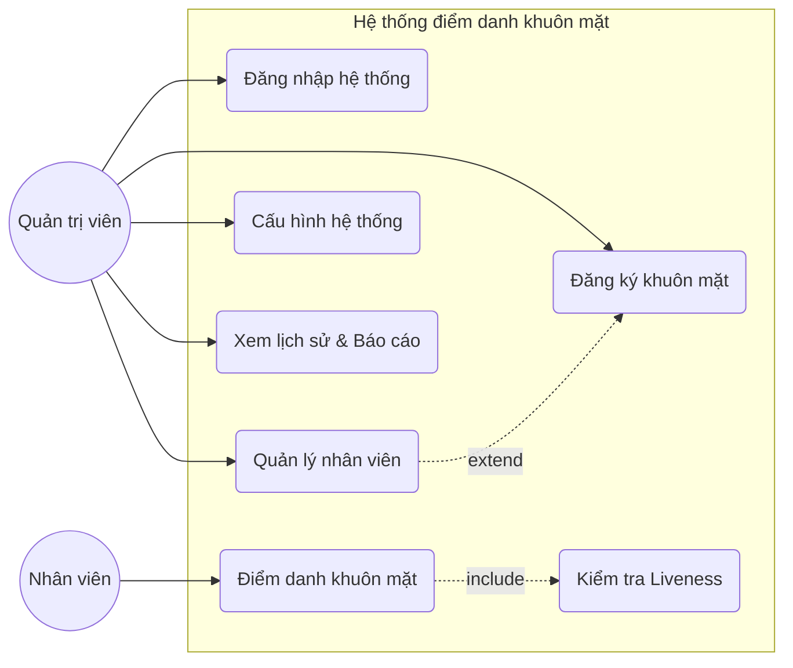
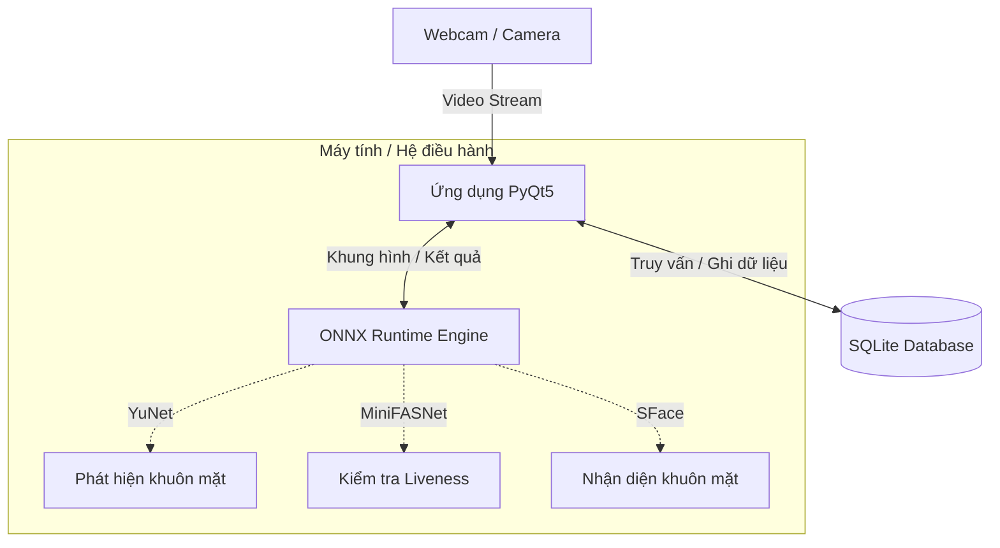
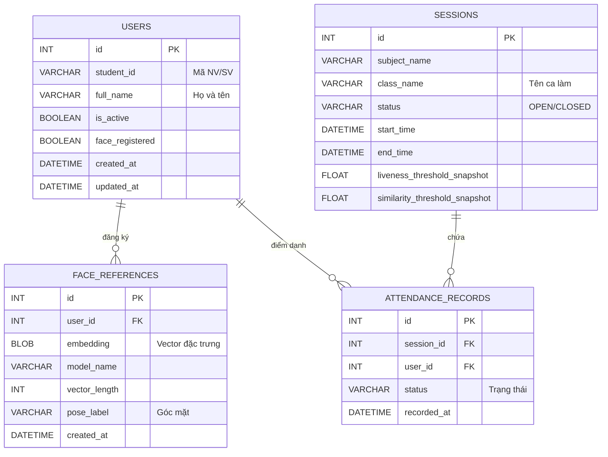
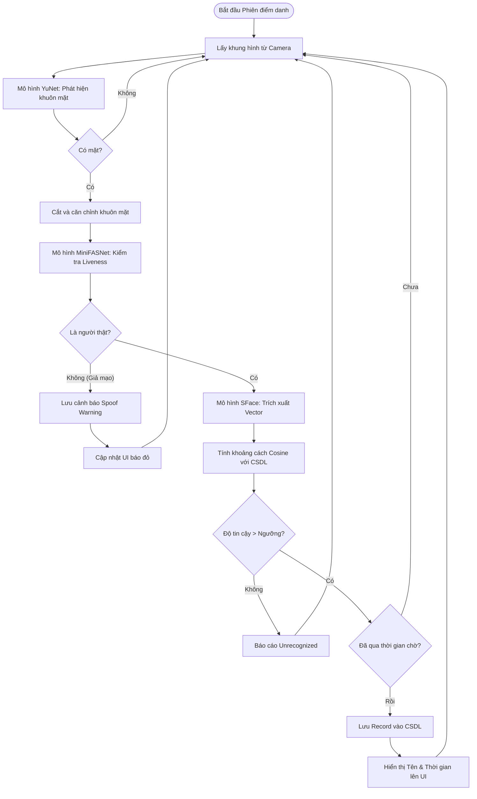
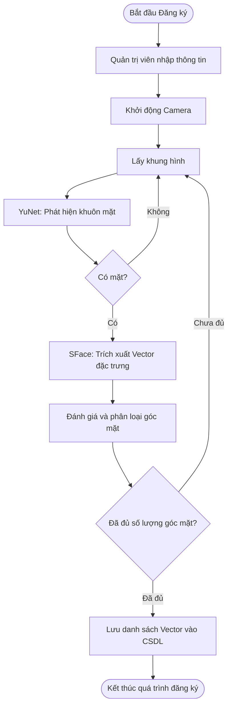
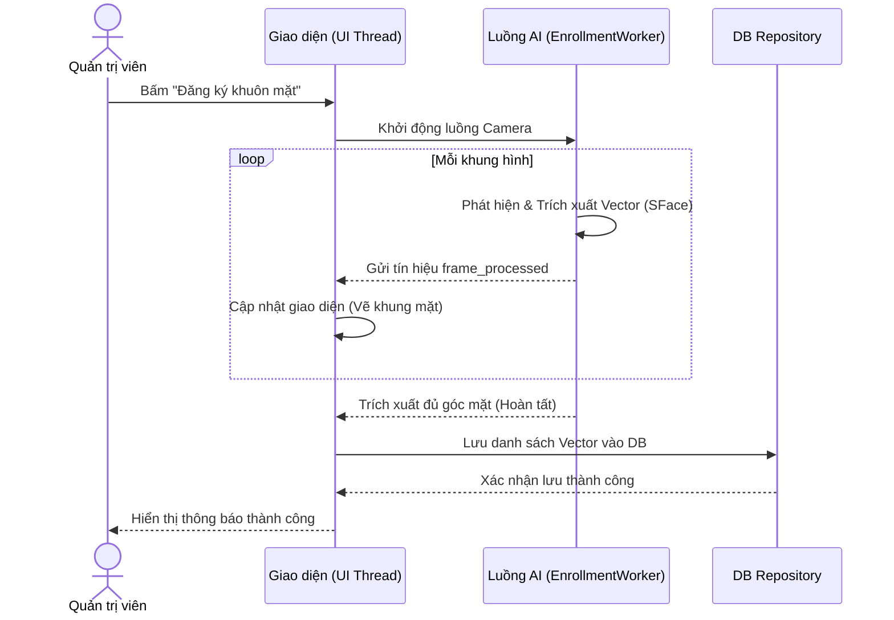
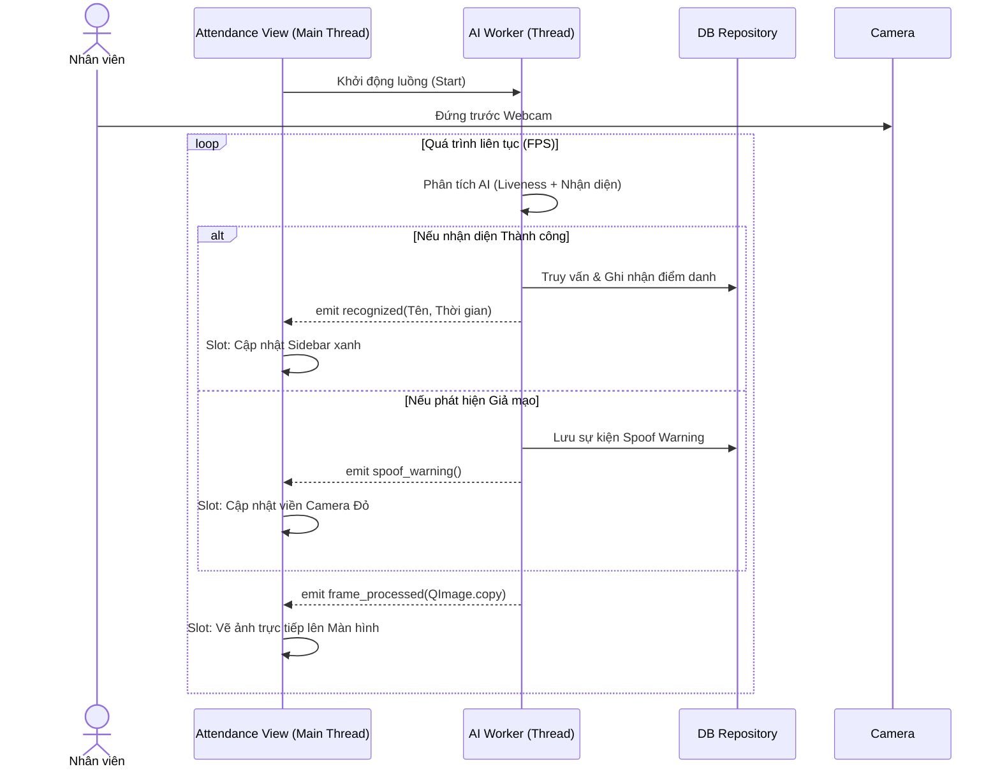

# Chương 3. PHÂN TÍCH VÀ THIẾT KẾ HỆ THỐNG

## 3.1. Phân tích yêu cầu

Phân tích yêu cầu là bước đầu tiên và quan trọng nhất nhằm xác định rõ hệ thống cần thực hiện những chức năng gì và đáp ứng các tiêu chí kỹ thuật nào. Dựa trên bối cảnh của đề tài là một hệ thống điểm danh ngoại tuyến (offline) có ứng dụng trí tuệ nhân tạo (AI), các yêu cầu được chia thành yêu cầu chức năng và yêu cầu phi chức năng.

### 3.1.1. Yêu cầu chức năng và Phi chức năng

#### 3.1.1.1. Yêu cầu chức năng

Hệ thống được thiết kế để phục vụ hai đối tượng chính là Quản trị viên (người quản lý phần mềm) và Nhân viên (người được điểm danh). Các yêu cầu chức năng được chia thành 4 module chính:

1. **Module Quản lý Nhân viên (User Management):**
   - Quản trị viên có thể thêm mới, cập nhật thông tin, hoặc xóa nhân viên.
   - Cho phép thu thập và đăng ký dữ liệu khuôn mặt của nhân viên thông qua camera (Face Enrollment). Dữ liệu này được mã hóa và lưu trữ cục bộ để phục vụ cho quá trình nhận diện sau này.

2. **Module Điểm danh tự động (Attendance/Face Recognition):**
   - Hệ thống tự động kích hoạt camera và nhận diện khuôn mặt nhân viên trong khung hình theo thời gian thực.
   - **Tích hợp tính năng Liveness (Chống giả mạo):** Hệ thống phải có khả năng phân biệt khuôn mặt người thật và các hình thức giả mạo 2D (như hình ảnh in trên giấy, hiển thị trên màn hình điện thoại).
   - Tự động ghi nhận thời gian đến/đi của nhân viên nếu nhận diện thành công và vượt qua bài kiểm tra Liveness.

3. **Module Quản lý Lịch sử và Báo cáo (History & Events):**
   - Lưu trữ toàn bộ lịch sử điểm danh của nhân viên.
   - Lưu trữ các sự kiện nhận diện (Recognition Events) bao gồm: Nhận diện thành công, Không nhận diện được (Unrecognized), và Phát hiện giả mạo (Spoof Warning).
   - Cung cấp giao diện để Quản trị viên xem, tra cứu và trích xuất lịch sử điểm danh.

4. **Module Cấu hình và Bảo mật (Settings & Admin Auth):**
   - Đăng nhập bảo mật dành cho Quản trị viên trước khi truy cập vào các giao diện quản lý.
   - Cho phép cấu hình các thông số hệ thống như: Chọn thiết bị camera, thiết lập ngưỡng tin cậy của mô hình nhận diện (Threshold), khoảng thời gian chờ (Cooldown) giữa các lần điểm danh, và quản lý cơ sở dữ liệu.

#### 3.1.1.2. Yêu cầu phi chức năng

Với đặc thù là một ứng dụng Desktop chạy mô hình học sâu, hệ thống phải đáp ứng các tiêu chuẩn kỹ thuật nghiêm ngặt:

1. **Hiệu năng (Performance):**
   - Tốc độ nhận diện phải đảm bảo thời gian thực (Real-time). UI không được xảy ra hiện tượng "đứng" hoặc "giật lag" trong quá trình AI xử lý khung hình. Việc này đòi hỏi hệ thống phải sử dụng kiến trúc đa luồng (chia tách luồng UI và luồng xử lý AI).
   - Các mô hình AI (Phát hiện khuôn mặt, Nhận diện, Liveness) phải được tối ưu hóa để chạy mượt mà trên CPU thông qua framework ONNX Runtime.

2. **Bảo mật (Security):**
   - Tất cả dữ liệu sinh trắc học (vector đặc trưng khuôn mặt) và dữ liệu điểm danh phải được lưu trữ hoàn toàn tại máy bộ (Offline), không gửi qua môi trường mạng (Internet) nhằm tránh rủi ro rò rỉ dữ liệu.
   - Mật khẩu của Quản trị viên phải được băm (hashing) an toàn (ví dụ: sử dụng thuật toán bcrypt).

3. **Độ tin cậy và Ổn định (Reliability):**
   - Cơ sở dữ liệu SQLite phải được cấu hình ở chế độ WAL (Write-Ahead Logging) để cho phép nhiều luồng (ví dụ: luồng AI và luồng UI) đọc/ghi dữ liệu đồng thời mà không bị khóa (Database Locked).
   - Ứng dụng phải có cơ chế tự bảo vệ (Circuit-breaker): Nếu luồng AI gặp lỗi liên tục (ví dụ: mô hình bị hỏng hoặc camera mất kết nối), hệ thống phải ngắt luồng AI an toàn thay vì làm sập toàn bộ ứng dụng.

### 3.1.2. Biểu đồ Use Case tổng quát

Dựa trên phân tích chức năng, hệ thống có hai tác nhân (Actor) chính:
- **Nhân viên:** Tương tác một cách thụ động với hệ thống thông qua camera. Nhân viên chỉ đứng trước camera để thực hiện thao tác điểm danh.
- **Quản trị viên:** Người trực tiếp sử dụng giao diện phần mềm để thiết lập, quản lý nhân sự và theo dõi báo cáo.

*(Ghi chú: Hình ảnh biểu đồ Use Case minh họa tương tác giữa các tác nhân và hệ thống).*

### 3.1.3. Đặc tả các Use Case chính

Để làm rõ hơn hành vi của hệ thống, dưới đây là đặc tả cho một số Use Case quan trọng:

#### 3.1.3.1. Đặc tả Use Case: Điểm danh khuôn mặt (kèm Liveness)
- **Tác nhân:** Nhân viên.
- **Mô tả:** Nhân viên đứng trước camera, hệ thống thu nhận hình ảnh, kiểm tra tính thực thể sống (Liveness) và tiến hành trích xuất đặc trưng để đối chiếu với CSDL.
- **Luồng sự kiện chính:**
  1. Camera thu thập khung hình chứa khuôn mặt.
  2. Hệ thống phát hiện và cắt vùng khuôn mặt (Face Detection).
  3. Mô hình Liveness đánh giá khuôn mặt là người thật hay giả mạo.
  4. Nếu là người thật, mô hình Nhận diện (Face Recognition) trích xuất vector đặc trưng và so khớp với danh sách nhân viên đã lưu.
  5. Nếu độ tương đồng vượt ngưỡng (Threshold), hệ thống ghi nhận sự kiện điểm danh thành công và hiển thị thông báo (tên, thời gian) trên màn hình.
- **Luồng ngoại lệ:** 
  - Liveness phát hiện giả mạo: Hệ thống từ chối điểm danh, lưu cảnh báo "Spoof Warning" vào lịch sử.
  - Không tìm thấy khuôn mặt khớp: Hệ thống báo lỗi "Unrecognized".

#### 3.1.3.2. Đặc tả Use Case: Quản lý Nhân viên và Đăng ký khuôn mặt
- **Tác nhân:** Quản trị viên.
- **Mô tả:** Quản trị viên thêm thông tin nhân viên mới và thu thập dữ liệu khuôn mặt để làm cơ sở nhận diện.
- **Luồng sự kiện chính:**
  1. Quản trị viên đăng nhập và truy cập màn hình Quản lý nhân viên.
  2. Nhập thông tin cơ bản ( Họ tên).
  3. Quản trị viên khởi động luồng Đăng ký khuôn mặt. Nhân viên đứng trước camera để hệ thống thu thập nhiều góc độ của khuôn mặt (giúp tăng độ chính xác).
  4. Hệ thống trích xuất vector đặc trưng và lưu vào CSDL.
  5. Thông báo cập nhật nhân viên thành công.

#### 3.1.3.3. Đặc tả Use Case: Xem lịch sử và Báo cáo
- **Tác nhân:** Quản trị viên.
- **Mô tả:** Quản trị viên theo dõi các sự kiện điểm danh trong ngày hoặc tìm kiếm lịch sử theo mốc thời gian.
- **Luồng sự kiện chính:**
  1. Quản trị viên truy cập màn hình Lịch sử điểm danh.
  2. Hệ thống truy xuất dữ liệu từ bảng `attendance_records` và `recognition_events`.
  3. Quản trị viên có thể sử dụng bộ lọc (ngày bắt đầu, ngày kết thúc) để xem các cảnh báo giả mạo hoặc danh sách điểm danh hợp lệ.

## 3.2. Thiết kế kiến trúc

### 3.2.1. Kiến trúc tổng thể hệ thống

Hệ thống được thiết kế theo mô hình client cục bộ (Local Desktop Application) nhằm đảm bảo tốc độ phản hồi thời gian thực và bảo mật dữ liệu tuyệt đối (không phụ thuộc vào mạng Internet). Kiến trúc tổng thể phản ánh luồng dữ liệu đi từ phần cứng (Camera) qua các lớp xử lý của phần mềm và cuối cùng là lưu trữ tại cơ sở dữ liệu.

Luồng dữ liệu tổng thể bao gồm các thành phần:
- **Thiết bị đầu vào (Camera/Webcam):** Cung cấp luồng video thời gian thực (Video Stream) cho hệ thống.
- **Hệ điều hành / Máy tính (PC):** Môi trường thực thi của phần mềm. Tận dụng tài nguyên CPU để xử lý các mô hình AI.
- **Ứng dụng Desktop (Python/PyQt5):** Quản lý giao diện người dùng, điều phối luồng thực thi và tiếp nhận khung hình từ Camera.
- **AI Engine (ONNX Runtime):** Nhận khung hình từ ứng dụng, thực hiện xử lý Deep Learning (Phát hiện khuôn mặt bằng YuNet, Liveness bằng MiniFASNet, Nhận diện bằng SFace) và trả về kết quả cho ứng dụng.
- **Lưu trữ cục bộ (SQLite):** Lưu trữ an toàn các thông tin cấu hình, danh sách nhân viên, vector đặc trưng khuôn mặt và lịch sử điểm danh.

### 3.2.2. Kiến trúc phân lớp phần mềm

Để mã nguồn dễ bảo trì và mở rộng, ứng dụng tuân thủ chặt chẽ **Kiến trúc 3 lớp (3-Tier / Layered Architecture)**. Các chức năng được chia tách rõ ràng thành các lớp sau:

1. **Lớp Giao diện (Presentation Layer - UI):**
   - Chịu trách nhiệm hiển thị thông tin và tiếp nhận tương tác từ người dùng.
   - Được xây dựng bằng framework `PyQt5`.
   - *Thành phần chính:* `MainWindow`, `UserModeView` (Màn hình điểm danh), `AdminModeView` (Quản lý hệ thống), `AttendanceHistoryWidget` (Tra cứu lịch sử).

2. **Lớp Dịch vụ và Logic nghiệp vụ (Service / Application Layer):**
   - Đóng vai trò cầu nối giữa UI và CSDL, xử lý các nghiệp vụ cốt lõi (như chạy mô hình AI, tính toán liveness, xử lý luồng camera).
   - *Thành phần chính:* 
     - `AIWorker` / `CameraThreadBase`: Quản lý luồng lấy ảnh từ camera và luồng chạy suy luận (inference) ONNX.
     - `FaceAttendanceService`: Điều phối nghiệp vụ điểm danh (tính khoảng cách Cosine Similarity, so khớp khuôn mặt).
     - `LivenessTracker`: Áp dụng kỹ thuật làm mượt chuỗi thời gian (EMA) và tính toán vùng giao nhau (IoU) để ổn định kết quả liveness.

3. **Lớp Dữ liệu (Data Access / Repository Layer):**
   - Chịu trách nhiệm tương tác trực tiếp với cơ sở dữ liệu SQLite, che giấu các câu lệnh SQL phức tạp khỏi lớp Service.
   - *Thành phần chính:* 
     - `DatabaseManager`: Quản lý kết nối SQLite và cơ chế WAL.
     - Các lớp Repository Pattern như `FaceReferenceRepository` (lưu trữ vector khuôn mặt), `AttendanceRecordRepository` (ghi nhận lịch sử). Đặc biệt, ứng dụng dùng `CachingFaceReferenceRepository` để lưu đệm dữ liệu trên RAM, giúp tăng tốc độ truy xuất khi điểm danh liên tục.

### 3.2.3. Kiến trúc xử lý đa luồng (Multithreading)

Đây là giải pháp kiến trúc quan trọng nhất để một ứng dụng Desktop chạy AI không bị treo (frozen UI). Ứng dụng sử dụng cơ chế `QThread` của PyQt5 để tách biệt hoàn toàn **Luồng giao diện (Main UI Thread)** và **Luồng xử lý AI (Worker Thread)**.

Những điểm nhấn kỹ thuật trong kiến trúc đa luồng của hệ thống:
- **Giao tiếp qua Signals/Slots:** Lớp UI không bao giờ gọi trực tiếp hàm của lớp AI đang chạy. Thay vào đó, AI Worker phát ra (emit) các tín hiệu (Signals) như `frame_processed` hoặc `liveness_failed`, và UI bắt (catch) các tín hiệu này thông qua Slots để cập nhật giao diện một cách an toàn.
- **Truyền dữ liệu an toàn (Thread-safe memory):** Khi một khung hình (QImage) được truyền từ luồng Camera sang luồng UI để hiển thị, hệ thống bắt buộc phải sử dụng phương thức `QImage.copy()`. Điều này đảm bảo vùng nhớ chứa ảnh không bị luồng Camera ghi đè trong khi luồng UI đang vẽ ảnh lên màn hình (tránh lỗi Crash phần mềm).
- **Cơ chế tự bảo vệ (Circuit-breaker):** Nếu luồng AI Worker gặp lỗi ngoại lệ liên tục (ví dụ do thiết bị ngắt kết nối hoặc lỗi thư viện ONNX), hệ thống sẽ đếm số lần lỗi. Khi vượt qua ngưỡng 30 lần lỗi liên tiếp (30 consecutive failures), cơ chế Circuit-breaker sẽ tự động kích hoạt, ngắt an toàn luồng AI và báo lỗi lên UI thay vì để ứng dụng sụp đổ hoàn toàn.

## 3.3. Thiết kế chi tiết

### 3.3.1. Thiết kế Cơ sở dữ liệu

Cơ sở dữ liệu của hệ thống được xây dựng trên nền tảng SQLite với cơ chế WAL (Write-Ahead Logging) hỗ trợ đa luồng. Dưới đây là Sơ đồ Thực thể - Mối kết hợp (ERD) tổng quát của 4 bảng quan trọng nhất cấu thành nên dữ liệu cốt lõi của hệ thống:

**Đặc tả chi tiết các bảng:**

**Bảng 1: Bảng `users` (Lưu thông tin nhân viên)**

| Tên cột         | Kiểu dữ liệu | Khóa   | Mô tả                                         |
| :-------------- | :----------- | :----- | :-------------------------------------------- |
| id              | INT          | PK     | ID tự tăng, định danh duy nhất                |
| student_id      | VARCHAR      | UNIQUE | Mã nhân viên / sinh viên                      |
| full_name       | VARCHAR      |        | Họ và tên                                     |
| is_active       | BOOLEAN      |        | Trạng thái hoạt động (1: Active, 0: Inactive) |
| face_registered | BOOLEAN      |        | Đánh dấu đã đăng ký khuôn mặt chưa (0/1)      |
| created_at      | DATETIME     |        | Thời gian tạo (ISO-8601)                      |
| updated_at      | DATETIME     |        | Thời gian cập nhật gần nhất                   |

**Bảng 2: Bảng `face_references` (Lưu trữ dữ liệu khuôn mặt đã mã hóa)**

| Tên cột | Kiểu dữ liệu | Khóa | Mô tả |
| :--- | :--- | :--- | :--- |
| id | INT | PK | ID tự tăng |
| user_id | INT | FK | Tham chiếu đến bảng `users` |
| embedding | BLOB | | Vector đặc trưng khuôn mặt (đã mã hóa nhị phân) |
| model_name | VARCHAR | | Tên mô hình dùng để trích xuất (ví dụ: 'SFace') |
| vector_length | INT | | Kích thước của vector đặc trưng |
| pose_label | VARCHAR | | Góc chụp khuôn mặt (ví dụ: 'center') |
| created_at | DATETIME | | Thời gian tạo |

**Bảng 3: Bảng `sessions` (Quản lý các ca làm việc / buổi học)**

| Tên cột      | Kiểu dữ liệu | Khóa | Mô tả                                       |
| :----------- | :----------- | :--- | :------------------------------------------ |
| id           | INT          | PK   | ID tự tăng                                  |
| subject_name | VARCHAR      |      | Tên bộ phận / môn học                       |
| class_name   | VARCHAR      |      | Tên ca làm / lớp                            |
| status       | VARCHAR      |      | Trạng thái (OPEN: đang mở, CLOSED: đã đóng) |
| start_time   | DATETIME     |      | Thời gian bắt đầu (ISO-8601)                |
| end_time     | DATETIME     |      | Thời gian kết thúc                          |
| liveness_threshold_snapshot | FLOAT | | Ngưỡng Liveness tại thời điểm mở phiên |
| similarity_threshold_snapshot | FLOAT | | Ngưỡng nhận diện tại thời điểm mở phiên |

**Bảng 4: Bảng `attendance_records` (Lịch sử điểm danh thành công)**

| Tên cột | Kiểu dữ liệu | Khóa | Mô tả |
| :--- | :--- | :--- | :--- |
| id | INT | PK | ID tự tăng |
| session_id | INT | FK | Ca làm việc (Tham chiếu `sessions`) |
| user_id | INT | FK | Người điểm danh (Tham chiếu `users`) |
| status | VARCHAR | | Trạng thái điểm danh (ví dụ: SUCCESS) |
| recorded_at | DATETIME | | Thời gian ghi nhận |

*(Ghi chú: Ngoài 4 bảng cốt lõi hình thành nên luồng nghiệp vụ chính được mô tả ở trên, CSDL vật lý của hệ thống còn bao gồm 3 bảng phụ trợ nhằm phục vụ mục đích quản trị và hệ thống: `admin_credentials` (lưu trữ mật khẩu Quản trị viên đã mã hóa), `system_settings` (bảng dạng Key-Value lưu tham số cấu hình phần mềm), và `recognition_events` (lưu trữ log chi tiết của luồng AI ở từng khung hình, phục vụ việc tra cứu cảnh báo giả mạo).*

### 3.3.2. Sơ đồ hoạt động (Activity Diagram)

#### 3.3.2.1. Sơ đồ luồng Điểm danh & Liveness

Quá trình điểm danh là một quy trình khép kín, xử lý liên tục từng khung hình (frame) lấy từ Camera. Thuật toán là sự kết hợp của 3 mô hình học sâu khác nhau để đảm bảo độ chính xác và tính bảo mật.

**Diễn giải chi tiết các bước:**
- **Bước 1 (Lấy khung hình):** Hệ thống đọc một khung hình (frame) mới nhất từ luồng dữ liệu của Camera.
- **Bước 2 (Phát hiện khuôn mặt):** Đưa khung hình qua mô hình AI `YuNet`. Nếu không tìm thấy khuôn mặt, hệ thống bỏ qua và lấy khung hình tiếp theo. Nếu có, thực hiện cắt (crop) và căn chỉnh vùng chứa khuôn mặt.
- **Bước 3 (Kiểm tra Liveness):** Đưa vùng khuôn mặt đã cắt qua mô hình `MiniFASNet` để xác định là người thật hay giả mạo (hình in, qua màn hình điện thoại).
  - Nếu phát hiện **Giả mạo**: Ghi nhận cảnh báo "Spoof Warning" vào lịch sử, viền camera trên giao diện đổi sang màu Đỏ, sau đó quay lại Bước 1.
  - Nếu là **Người thật**: Tiếp tục Bước 4.
- **Bước 4 (Trích xuất đặc trưng):** Đưa khuôn mặt qua mô hình `SFace` để trích xuất thành một vector đặc trưng đa chiều (embedding).
- **Bước 5 (So khớp):** Tính toán khoảng cách `Cosine Similarity` giữa vector vừa trích xuất và toàn bộ danh sách vector của nhân viên trong CSDL.
  - Nếu độ tin cậy < Ngưỡng: Cảnh báo Không nhận diện được (Unrecognized) và quay lại Bước 1.
  - Nếu độ tin cậy > Ngưỡng: Kiểm tra thời gian chờ (Cooldown) của nhân viên này để tránh việc ghi nhận liên tục.
- **Bước 6 (Ghi nhận):** Lưu lịch sử vào bảng `attendance_records`, cập nhật thông tin (Tên, Thời gian) lên màn hình (UI viền Xanh) và kết thúc một chu kỳ xử lý của khung hình.

#### 3.3.2.2. Sơ đồ luồng Đăng ký khuôn mặt (Face Enrollment)

Quá trình đăng ký khuôn mặt diễn ra khi Quản trị viên thêm nhân viên mới. Quá trình này đơn giản hơn luồng điểm danh vì không yêu cầu kiểm tra Liveness.

**Diễn giải chi tiết các bước:**
- **Bước 1 (Khởi tạo):** Quản trị viên nhập mã nhân viên và họ tên trên giao diện, sau đó kích hoạt luồng camera.
- **Bước 2 (Lấy ảnh & Phát hiện khuôn mặt):** Hệ thống liên tục bắt các khung hình từ camera. Sử dụng mô hình `YuNet` để tìm kiếm và cắt vùng khuôn mặt.
- **Bước 3 (Trích xuất đặc trưng):** Đưa vùng khuôn mặt tìm được qua mô hình `SFace` để tính toán vector đặc trưng (embedding).
- **Bước 4 (Kiểm tra điều kiện dừng):** Hệ thống đánh giá góc mặt của khung hình hiện tại và kiểm tra xem đã thu thập đủ số lượng mẫu yêu cầu chưa. Nếu chưa đủ, quay lại Bước 2 để lấy thêm khung hình mới.
- **Bước 5 (Lưu trữ):** Khi đã thu thập đủ lượng mẫu cần thiết, hệ thống tự động dừng camera và lưu toàn bộ danh sách vector thu được vào bảng `face_references`.

### 3.3.3. Sơ đồ tuần tự (Sequence Diagram)

#### 3.3.3.1. Luồng Đăng ký khuôn mặt (Face Enrollment)

Luồng này mô tả cách Quản trị viên tương tác với phần mềm để thêm dữ liệu khuôn mặt cho nhân viên mới. Giao diện (UI) và Luồng AI chạy song song để vừa hiển thị hình ảnh, vừa trích xuất vector.

**Diễn giải chi tiết các bước (Luồng Đăng ký):**
- **Bước 1:** Quản trị viên nhập thông tin nhân viên trên UI và bấm "Đăng ký khuôn mặt". UI ra lệnh cho luồng `EnrollmentWorker` kích hoạt camera.
- **Bước 2:** Với mỗi khung hình nhận được, Worker sử dụng các mô hình AI để phát hiện và trích xuất vector khuôn mặt.
- **Bước 3:** Worker liên tục phát tín hiệu (`emit frame_processed`) kèm ảnh. Lớp UI hứng tín hiệu này để cập nhật giao diện (vẽ khung hình chữ nhật bám theo khuôn mặt) trực tiếp lên màn hình.
- **Bước 4:** Khi Worker thu thập đủ các góc độ khuôn mặt cần thiết, quá trình trích xuất tự động kết thúc.
- **Bước 5:** UI nhận lại danh sách các vector hoàn chỉnh, gọi Repository để lưu thông tin xuống SQLite, và hiển thị thông báo thành công cho Quản trị viên.

#### 3.3.3.2. Luồng Điểm danh đa luồng (Attendance Threading)

Đây là luồng thực thi liên tục khi hệ thống ở trạng thái điểm danh. Sơ đồ nhấn mạnh việc giao tiếp không đồng bộ (Asynchronous) thông qua Signals/Slots giữa luồng UI và luồng AI.

**Diễn giải chi tiết các bước (Luồng Điểm danh đa luồng):**
- **Bước 1:** Khi ca làm việc được mở, Main Thread (chạy giao diện) ra lệnh khởi động AI Worker (chạy ở một luồng độc lập hoàn toàn).
- **Bước 2:** Nhân viên đứng vào vùng nhận diện của camera. AI Worker chạy vòng lặp liên tục để đọc khung hình. Ở giai đoạn này, luồng UI hoàn toàn rảnh rỗi và không bị giật lag (frozen) khi AI xử lý nặng.
- **Bước 3:** Tại mỗi vòng lặp, AI Worker phân tích Liveness và Nhận diện trên CPU.
- **Bước 4 (Cập nhật dữ liệu thông qua Signal/Slot):**
  - **Nếu nhận diện thành công:** AI lưu trạng thái vào CSDL, phát tín hiệu `recognized`. Luồng UI bắt tín hiệu này để thêm dòng chữ màu Xanh vào thanh danh sách nhân viên bên phải (Sidebar).
  - **Nếu giả mạo:** AI lưu log Spoof Warning, phát tín hiệu `spoof_warning`. Luồng UI bắt tín hiệu để chớp viền khung camera sang màu Đỏ.
- **Bước 5:** Cuối mỗi chu kỳ phân tích, AI Worker thực hiện sao chép vùng nhớ an toàn (`QImage.copy`) và gửi tín hiệu `frame_processed` về UI. Luồng UI vẽ khung hình mới lên màn hình để tạo cảm giác camera đang chạy mượt mà (real-time).

## 3.4. Thiết kế giao diện (UI Design)

Giao diện của hệ thống được xây dựng trên nền tảng **PyQt5**. Nhằm mang lại trải nghiệm người dùng (UX) hiện đại và chuyên nghiệp nhất, ứng dụng không sử dụng bộ giao diện thô cứng mặc định của hệ điều hành mà được tùy biến toàn diện thông qua công nghệ QSS (Qt Style Sheets - tương tự CSS trên nền tảng web).

### 3.4.1. Tiêu chuẩn thiết kế giao diện

Hệ thống tuân theo ngôn ngữ thiết kế **Minimalist (Tối giản)** kết hợp với phong cách **Modern Enterprise App** (Ứng dụng doanh nghiệp hiện đại):

- **Font chữ chủ đạo:** `Segoe UI` (kích thước chuẩn 15px cho văn bản thường, 26px cho Tiêu đề chính). Đây là font chữ được tối ưu hóa cho khả năng hiển thị mượt mà và dễ đọc trên nền tảng Windows.
- **Bảng màu (Color Palette):**
  - **Màu nền (Background):** Sử dụng giao diện Sáng (Light Theme) làm chủ đạo với nền xám nhạt (`#f8fafc`) kết hợp với nền trắng tinh (`#ffffff`) cho các thẻ nội dung (Card) nhằm tạo sự thanh thoát.
  - **Màu nhấn (Accent Color):** Xanh dương (`#2563eb`) được sử dụng cho các nút bấm chính (Primary Button), thanh tiến trình và viền ô nhập liệu khi tương tác, giúp người dùng dễ dàng nhận biết khu vực thao tác cốt lõi.
  - **Màu tương phản:** Thanh công cụ bên trái (Sidebar) sử dụng màu xám đen (`#1e293b`) tạo độ tương phản mạnh mẽ, giúp ứng dụng trông sang trọng và phân chia không gian rõ rệt.
- **Tiêu chuẩn UX/UI:** Các phần tử giao diện như nút bấm, ô nhập liệu, danh sách đều được thiết kế bo góc tròn (border-radius 6px - 8px) và hỗ trợ hiệu ứng thay đổi màu sắc khi di chuột qua (Hover) hoặc khi nhấn (Pressed), mang lại cảm giác phản hồi nhanh nhạy. Các thông báo trạng thái được quy định bằng màu sắc trực quan: Xanh lá (`#16a34a`) cho Thành công, Đỏ (`#dc2626`) cho Lỗi/Giả mạo.

### 3.4.2. Thiết kế các màn hình chính

Hệ thống phần mềm được chia thành 3 màn hình cốt lõi, phục vụ cho 2 đối tượng là Nhân viên (chỉ điểm danh) và Quản trị viên (quản lý toàn bộ hệ thống).

#### 3.4.2.1. Màn hình Điểm danh (User Mode View)

Đây là màn hình hoạt động thường trực của hệ thống, được thiết kế tối giản tối đa để nhân viên tự thao tác mà không cần hướng dẫn.

- **Khu vực Camera (Trái):** Chiếm 70% diện tích màn hình. Hiển thị luồng video trực tiếp từ thiết bị. Khi phát hiện khuôn mặt, hệ thống tự động vẽ khung chữ nhật bao quanh. Khung sẽ có viền màu Xanh lá (Điểm danh thành công) hoặc chớp viền màu Đỏ (Cảnh báo giả mạo Spoofing).
- **Khu vực Trạng thái (Phải):** Chiếm 30% diện tích. Gồm một bảng thống kê số lượng điểm danh thành công, và một danh sách (List View) liên tục cập nhật dòng chữ hiển thị họ tên cùng thời gian của những nhân viên vừa điểm danh thành công gần nhất.

*(Vị trí chèn ảnh minh họa)*
``

#### 3.4.2.2. Màn hình Quản lý Nhân sự & Đăng ký khuôn mặt

Màn hình dành riêng cho Quản trị viên (yêu cầu đăng nhập), hỗ trợ quản lý vòng đời dữ liệu của nhân viên.

- **Bảng dữ liệu Nhân viên (Data Table):** Hiển thị danh sách toàn bộ nhân viên dưới dạng bảng lưới (Grid) với các cột như Mã NV, Họ tên, Trạng thái hoạt động, và Trạng thái đã đăng ký khuôn mặt hay chưa. Bảng hỗ trợ cuộn và chọn từng dòng.
- **Luồng Đăng ký khuôn mặt (Enrollment Dialog):** Khi Quản trị viên chọn một nhân viên chưa có dữ liệu mặt và bấm "Đăng ký", một hộp thoại phụ sẽ hiện lên. Hộp thoại này chứa luồng video thu nhỏ, hướng dẫn nhân viên xoay các góc mặt và hiển thị thanh tiến trình (Progress Bar) thông báo mức độ hoàn thành quá trình trích xuất vector.

*(Vị trí chèn ảnh minh họa)*
``

#### 3.4.2.3. Màn hình Lịch sử & Báo cáo (Attendance History)

Cung cấp công cụ tra cứu thông tin điểm danh trong quá khứ dành cho mục đích kiểm soát hoặc kế toán.

- **Khu vực Bộ lọc (Filters):** Đặt ở cạnh trên, cho phép Quản trị viên chọn khoảng thời gian (Ngày bắt đầu - Ngày kết thúc) thông qua bộ chọn lịch và bấm nút tìm kiếm.
- **Khu vực Hiển thị kết quả:** Bảng dữ liệu liệt kê chi tiết từng bản ghi điểm danh (Mã NV, Họ Tên, Thời gian điểm danh, Tên ca làm việc). 
- **Chức năng Trích xuất:** Cung cấp chức năng kết xuất (Export) toàn bộ dữ liệu đang hiển thị ra định dạng file phổ biến (như Excel/CSV) để phục vụ công tác báo cáo nhân sự bên ngoài hệ thống.

*(Vị trí chèn ảnh minh họa)*
``
